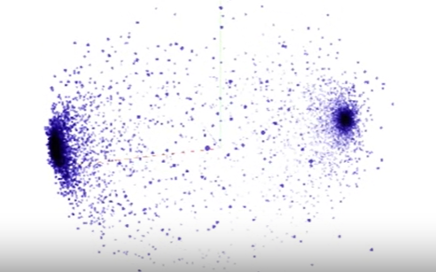

 # Embeddings

 Moving beyond text data processing ranging from pre-processing, reading from raw files and tokenizing text.

 ### Working w/ Text Embeddings.

 **`Embeddings`** means `tokens` are mapped as **vectors** in a high dimension space. With Embeddings and labelled examples, these vectors can then be tuned so that words with similar meaning will have a similar direction in the **vector space**. This will begin the process of training a neural network to understand sentiment in text - and we'll begin by looking at IMDB movie reviews, *training a neural network* on texts that are labelled '`positive`' or '`negative`' and determining which words in a sentence drive those meanings.  

 

  
  

## Wraps: What I Have Learned

- Looked at taking tokenized words and passing them to an Embedding layer.

- Embeddings map vocabulary to vectors in higher-dimensional space. 

- The semantics of the words were learned when those words were labeled with similar meanings. For example, when looking at movie reviews, those movies with positive sentiment had the dimensionality of their words ending up pointing a particular way, and those with negative sentiment pointing in a different direction. From these, the words in future reviews could have their direction established and your model can infer the sentiment from it. 

- Looked at subword tokenization
